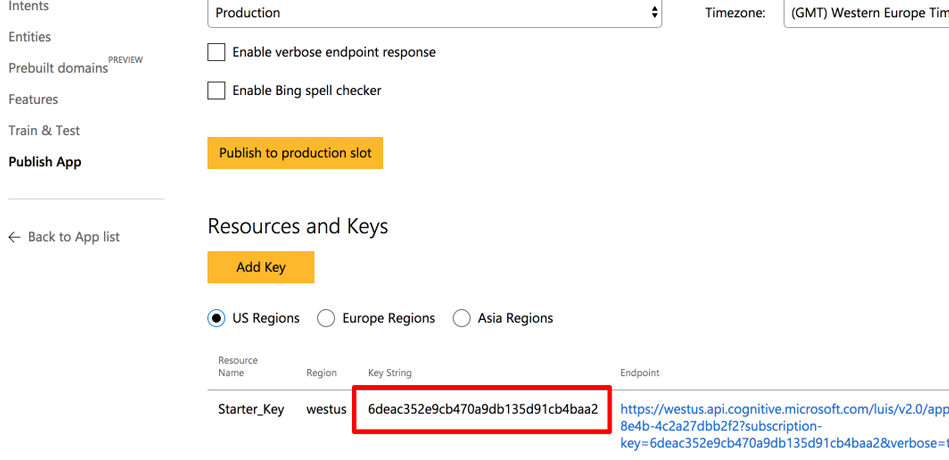

# LUIS Bot Integration Sample - Hotel Finder

A sample bot using LuisDialog to integrate with a LUIS.ai application. The `cs` and `node.js` folders provide C# and Node.js implementations, respectively.

### Outcome

You will see the following in the Bot Framework Emulator when opening and running the sample solution.

### Prerequisites

The minimum prerequisites to run this sample are:
* The latest update of Visual Studio 2015. You can download the community version [here](http://www.visualstudio.com) for free.
* The Bot Framework Emulator. To install the Bot Framework Emulator, download it from [here](https://emulator.botframework.com/). Please refer to [this documentation article](https://github.com/microsoft/botframework-emulator/wiki/Getting-Started) to know more about the Bot Framework Emulator.

#### LUIS Application

The first step to using LUIS is to create or import an application. Go to the home page, www.luis.ai, and log in. After creating your LUIS account you'll be able to Import an Existing Application where can you can select a local copy of the LuisBot.json file an import it.

If you want to test this sample, you have to import the pre-build [LuisBot.json](LuisBot.json) file to your LUIS account.

Once you imported the application you'll need to "train" the model ([Training](https://docs.microsoft.com/en-us/azure/cognitive-services/luis/train-test)) before you can "Publish" the model in an HTTP endpoint. For more information, take a look at [Publishing a Model](https://docs.microsoft.com/en-us/azure/cognitive-services/luis/publishapp).

#### Where to find the Application ID and Endpoint Key

You'll need these two values to configure the code in your application:

1. Application ID

    In the LUIS application's dashboard, you can copy the App ID from the address bar.
    
    
    
2. Endpoint Key

    Once your app is published, copy the endpoint key from the application resources on the Publish App page.

    
    

### Highlights

One of the key problems in human-computer interactions is the ability of the computer to understand what a person wants, and to find the pieces of information that are relevant to their intent. In the LUIS application, you will bundle together the intents and entities that are important to your task. Read more about [Planning an Application](https://www.microsoft.com/cognitive-services/en-us/LUIS-api/documentation/Plan-your-app) in the LUIS Help Docs.

This application has three intents: SearchHotels, SearchHotelReviews, and Help. It also detects a Destination entity and an AirportCode entity.

Each intent has a handler method accepts a result from LUIS including the matching Intents and Entities for the LUIS query. 

In addition, the `AirportCode` entity makes use of the LUIS Pattern Features which helps LUIS infer entities, for instance, Airport Codes consist of three consecutive alphabetic characters. You can read more about Pattern Features in the [Add Patterns](https://docs.microsoft.com/en-us/azure/cognitive-services/luis/luis-how-to-model-intent-pattern) section of the LUIS Help Docs.

Another LUIS Model Feature used is [Phrase List Features](https://docs.microsoft.com/en-us/azure/cognitive-services/luis/luis-how-to-add-features), for instance, the model includes a phrase list named Near which categorizes the words: near, around, close and nearby. Phrase list features work for both words and phrase and what LUIS learns about one phrase will automatically be applied to the others as well.

> Note: Phrase List is transparent from the Bot's implementation perspective. Think of model features as "hints" used by the Machine Learning algorithm to help categorize and recognize words that compound Entities and Intents.

### More Information

To get more information about how to get started in Bot Builder for .NET and Conversations please review the following resources:
* [Bot Builder for .NET](https://docs.microsoft.com/en-us/bot-framework/dotnet/)
* [Add language understanding to a bot](https://docs.microsoft.com/en-us/bot-framework/cognitive-services-add-bot-language)
* [LUIS Help Docs](https://www.luis.ai/help#luis-help)
* [Cognitive Services Documentation](https://docs.microsoft.com/en-us/azure/cognitive-services/luis/home)
* [Specify initial form state and entities](https://docs.microsoft.com/en-us/bot-framework/dotnet/bot-builder-dotnet-formflow-advanced#specify-initial-form-state-and-entities)
* Other examples using LUIS
    * [Alarm Bot](https://docs.microsoft.com/en-us/bot-framework/dotnet/bot-builder-dotnet-luis-dialogs#alarm-bot-implementation)
    * [Weather Bot](https://docs.microsoft.com/en-us/bot-framework/cognitive-services-add-bot-language#language-understanding-bot-example)
* [Bing Spell Check API](https://www.microsoft.com/cognitive-services/en-us/bing-spell-check-api)

> **Limitations**  
> The functionality provided by the Bot Framework Activity can be used across many channels. Moreover, some special channel features can be unleashed using the [ChannelData property](https://docs.microsoft.com/en-us/bot-framework/dotnet/bot-builder-dotnet-channeldata).
> 
> The Bot Framework does its best to support the reuse of your Bot in as many channels as you want. However, due to the very nature of some of these channels, some features are not fully portable.
> 
> The features used in this sample are fully supported in the following channels:
> - Skype
> - Facebook
> - Microsoft Teams
> - DirectLine
> - WebChat
> - Slack
> - GroupMe
> 
> They are also supported, with some limitations, in the following channels:
> - Kik
> - Email
> 
> On the other hand, they are not supported and the sample won't work as expected in the following channels:
> - Telegram
> - SMS
