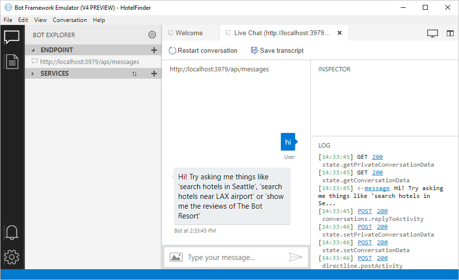

# LUIS Bot Sample

A sample bot integrated with a LUIS.ai application that allows users to find hotels through a chat client.

## Features

* Bundled [intents](https://docs.microsoft.com/en-us/azure/cognitive-services/luis/luis-concept-intent) and [entities](https://docs.microsoft.com/en-us/azure/cognitive-services/luis/luis-concept-entity-types) from LUIS that focus on one task. Understand more about bundling in [Plan your app](https://www.microsoft.com/cognitive-services/en-us/LUIS-api/documentation/Plan-your-app).

* LUIS Patterns that help LUIS infer entities. Learn more about how [Patterns improve prediction accuracy](https://docs.microsoft.com/en-us/azure/cognitive-services/luis/luis-concept-patterns).

* LUIS Phrase List Features that categorize similar words into a single word category. Learn more about [Phrase list features in LUIS](https://docs.microsoft.com/en-us/azure/cognitive-services/luis/luis-concept-feature).

* Bing Spell Check (optional) that corrects common spelling errors the user may type into the chat client. Learn more about how to [Correct misspelled words with Bing Spell Check](https://docs.microsoft.com/en-us/azure/cognitive-services/luis/luis-tutorial-bing-spellcheck).

## Prerequisites

* The latest update of Visual Studio 2015+. You can download the community version [here](http://www.visualstudio.com) for free.

* The Bot Framework Emulator. To install the Bot Framework Emulator, download it from [here](https://emulator.botframework.com/). See the [Getting Started](https://github.com/microsoft/botframework-emulator/wiki/Getting-Started) article to know more about the Bot Framework Emulator. The bot emulator is now v4.


### Set up the LUIS application

1. Go to the home page, www.luis.ai, and either create a new account or log in to an existing account. 

1. Click on 'My Apps' to show a list of all your apps (if any).

1. Import our prebuilt app by clicking "Import new app", then select a local copy of the [LuisBot.json](LuisBot.json) file from this sample to import.

    

1. Next, you'll need to train the model by clicking on your app and selecting "Train" in the upper right. See more about [Training](https://docs.microsoft.com/en-us/azure/cognitive-services/luis/train-test). 

1. After training, publish your app by selecting "Publish" in the upper right. See more about [Publishing a Model](https://docs.microsoft.com/en-us/azure/cognitive-services/luis/publishapp).

### Prepare the Visual Studio app

Once you have cloned and opened the Hotel Finder sample into Visual Studio, you need to replace a few variables with your app-specific keys.

1. Edit the [RootLuisDialog.cs](Dialogs/RootLuisDialog.cs#L14) file and update the LuisModel attribute placeholders with the values corresponding to your Application ID and Endpoint ID (see below to locate).

        ````C#
        ...
        using Microsoft.Bot.Builder.Luis.Models;
        using Microsoft.Bot.Connector;

        [LuisModel("YourAppId", "YourEndpointKey")]
        public class RootLuisDialog : LuisDialog<object>
        {
        ...
        ````

1. If you want to enable spelling correction, add your Bing Spell Check key to the [Web.config](Web.config) file. To find the key, go to LUIS.ai and click on the LuisBot you uploaded. Go to the "Manage" tab and select the leftside menu "Keys and Endpoints". On the page, look under the "Endpoint Keys" heading and click the button near Bing Spell Check to enable it. Once it's on, a popup will tell you how to get an API key for Bing Spell Check. Get it and put it into your Visual Studio app.

1. Now change the `IsSpellCorrectionEnabled` key's value to `true` in the [Web.config](Web.config) file.

#### Where to find the Application ID and Endpoint Key

You'll need these two values to configure the LuisDialog through the LuisModel attribute:

1. Application ID

    In the LUIS application's dashboard, you can copy the App ID from the address bar.
    
    
    
1. Endpoint Key

    Once your app is published, make sure you have your app selected. Go to Manage > Keys and Endpoints. Copy the Authoring Key.

## Run and test the sample

1. Once your keys are in place, run the sample in Visual Studio.

1. You will see a browser window open and display your localhost number in the address bar.

1. Open the Bot Emulator v4 application. 

1. You'll see the Welcome page where you can import a .bot file. If your samples is still using the bot v3 SDK, then you'll need to create your own .bot by clicking "Create a new bot configuration", located under the "Open Bot" button.

1. A popup appears that asks for your Bot Name (whatever you want to call it is fine) and your Endpoint URL. To find your endpoint, get them from the browser that opened when you ran the Visual Studio solution. You'll see your localhost port in the browser, go ahead and use it in part of your endpoint. You total endpoint should look something like this: `http://localhost:3979/api/messages`. You do not need to worry about providing a Microsoft App ID and a Microsoft APP Password (they are optional). Then choose "Save and connect". A .bot file gets created in your sample.

1. When you see `POST 201 directline.startConversation`, your bot is ready to receive text as input.

1. Start by typing "hi" in the chat window. It will respond with more usage instructions to follow.

NOTE: in order to use the chat client, the app must be running in Visual Studio.

Your emulator may look like this:



## Code highlights - understanding key parts

One of the main problems in human-computer interactions is the ability of the computer to understand what a person wants and find the pieces of information that are relevant to their intent. In the LUIS application, you've bundled together the intents and entities that are important to your task. 

Here are LuisIntent attributes decorating [RootLuisDialog](Dialogs/RootLuisDialog.cs#L36) methods to handle LUIS Intents, for instance `[LuisIntent("SearchHotels")]`.

````C#
[LuisIntent("SearchHotels")]
public async Task Search(IDialogContext context, IAwaitable<IMessageActivity> activity, LuisResult result)
{
    ...
}
````

Each intent handler method accepts the `IDialogContext`, the original incoming `IMessageActivity` message and the `LuisResult`, including the matching Intents and Entities for the LUIS query. In the snippet below, the [RootLuisDialog](Dialogs/RootLuisDialog.cs#L46) class retrieves a city value from the processed, [pre-built entity](https://www.microsoft.com/cognitive-services/en-us/LUIS-api/documentation/Pre-builtEntities).

````C#
EntityRecommendation cityEntityRecommendation;

if (result.TryFindEntity(EntityGeographyCity, out cityEntityRecommendation))
{
    cityEntityRecommendation.Type = "Destination";
}
````

You might notice the use of `EntityRecommendation.Type = "Destination"` in the code above. This is useful to map entity values to properties when reusing the LUIS captured entities for the  [`FormDialog<HotelsQuery>`](Dialogs/RootLuisDialog.cs#L51). The properties mapped to entities will be pre-populated. In the case of `AirportCode`, this extra step is not required since the entity name already matches the property name.

````C#
var hotelsFormDialog = new FormDialog<HotelsQuery>(hotelsQuery, this.BuildHotelsForm, FormOptions.PromptInStart, result.Entities);
````

In addition, the `AirportCode` entity makes use of the [LUIS Patterns](https://docs.microsoft.com/en-us/azure/cognitive-services/luis/luis-concept-patterns) which help LUIS infer entities, for instance, Airport Codes consist of three consecutive alphabetic characters. 

Another LUIS Model Feature used is Phrase List, for instance, the model includes a phrase list named "Near" which categorizes the words: near, around, close and nearby. Phrase list features work for both words and phrases. What LUIS learns about one phrase will automatically be applied to the others as well.

> Note: Phrase List is transparent from the Bot's implementation perspective. Think of model features as "hints" used by the Machine Learning algorithm to help categorize and recognize words that compound Entities and Intents.


### Spelling Correction

Bing Spell Check API provides a module that allows you to to correct the spelling of the text. Check out the [reference](https://dev.cognitive.microsoft.com/docs/services/56e73033cf5ff80c2008c679/operations/56e73036cf5ff81048ee6727) to know more about the modules available. 

[BingSpellCheckService.cs](Services/BingSpellCheckService.cs) is the core component illustrating how to call the Bing Spell Check RESTful API.

In this sample we added spell correction before calling the dialog. Check out the usage in [MessagesController.cs](Controllers/MessagesController.cs).

````C#
if (IsSpellCorrectionEnabled)
{
    try
    {
        activity.Text = await this.spellService.GetCorrectedTextAsync(activity.Text);
    }
    catch(Exception ex)
    {
        Trace.TraceError(ex.ToString());
    }
}
await Conversation.SendAsync(activity, () => new RootLuisDialog());
````

## More Information

To get more information about how to get started in Bot Builder for .NET and Conversations please review the following resources:
* [Bot Builder for .NET](https://docs.microsoft.com/en-us/bot-framework/dotnet/)
* [Add language understanding to a bot](https://docs.microsoft.com/en-us/bot-framework/cognitive-services-add-bot-language)
* [Cognitive Services LUIS Documentation](https://docs.microsoft.com/en-us/azure/cognitive-services/luis/home)
* [Specify initial form state and entities](https://docs.microsoft.com/en-us/bot-framework/dotnet/bot-builder-dotnet-formflow-advanced#specify-initial-form-state-and-entities)
* [Bing Spell Check API](https://www.microsoft.com/cognitive-services/en-us/bing-spell-check-api)

> **Limitations**  
> The functionality provided by the Bot Framework Activity can be used across many channels. Moreover, some special channel features can be unleashed using the [ChannelData property](https://docs.microsoft.com/en-us/bot-framework/dotnet/bot-builder-dotnet-channeldata).
> 
> The Bot Framework does its best to support the reuse of your Bot in as many channels as you want. However, due to the very nature of some of these channels, some features are not fully portable.
> 
> The features used in this sample are fully supported in the following channels:
> - Skype
> - Facebook
> - Microsoft Teams
> - DirectLine
> - WebChat
> - Slack
> - GroupMe
> 
> They are also supported, with some limitations, in the following channels:
> - Kik
> - Email
> 
> On the other hand, they are not supported and the sample won't work as expected in the following channels:
> - Telegram
> - SMS
