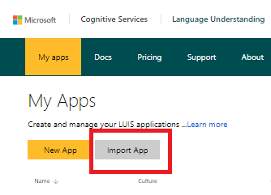
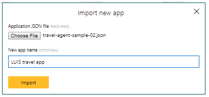
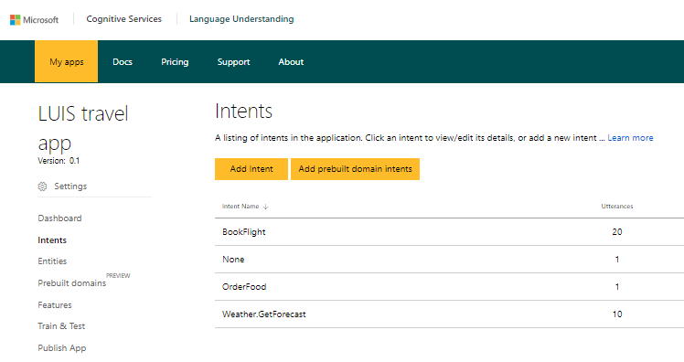
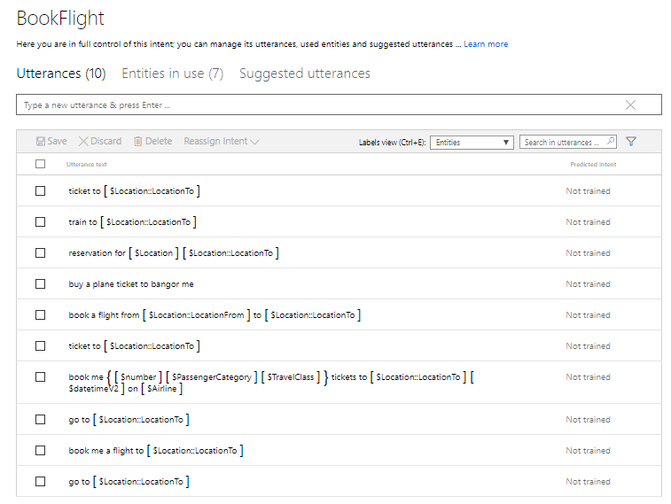
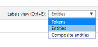
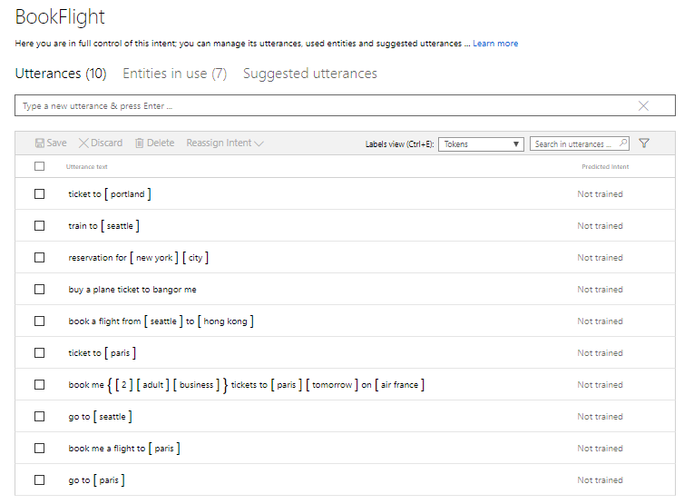

# Add utterances to a LUIS app programmatically

This sample is file is the [add-utterances.js](./add-utterances.js). It uploads utterances to a LUIS app from a JSON file, and optionally trains the LUIS app to learn from the utterances. 

### Files 
- [add-utterances.js](./add-utterances.js) : sample script for adding utterances to a LUIS app.
- [utterances.json](./utterances.json) : JSON file listing one or more utterances to add
- [travel-agent-sample-app.json](./travel-agent-sample-app.json) : sample LUIS app to import into https://www.luis.ai

## Set up the LUIS app

Before you run the sample you need to set up the LUIS app by importing it. To create the LUIS app, log in to https://www.luis.ai using an email associated with a [Cognitive Services account](https://docs.microsoft.com/en-us/azure/cognitive-services/cognitive-services-apis-create-account). Once you have logged in, you can import the LUIS app that you'll add utterances to.

### Import the LUIS app
Log in to https://www.luis.ai, and click the **Import App** button under **My Apps**.



In the **Import new app** dialog, choose the [travel-agent-sample-app.json](./travel-agent-sample-app.json) file, give the app any name you choose, and then click Import.



### View utterances associated with an intent
Then click on the entry for your app in **My Apps**, then click on **Intents** in the left-side navigation.



To see **Utterances** associated with an intent, double-click on the **BookFlight** intent.



Choose **Tokens** in label view to be able to see the text that's labeled as entities.



The utterances you can add using [add-utterances.js]('./add-utterances.js) should show up in the list of utterances when they've been successfully added:



## Run the sample

### Prerequisites
The prerequisites to run this sample are:
* Latest Node.js with NPM. Download it from [here](https://nodejs.org/en/download/).
* A [created](https://docs.microsoft.com/en-us/azure/cognitive-services/LUIS/create-app) LUIS Application. 
* **[Recommended]** Visual Studio Code for IntelliSense and debugging, download it from [here](https://code.visualstudio.com/) for free.

### Install Node.js dependencies
Install the Node.js dependencies from NPM in the terminal/command line.

````
> npm install
````

### Change Configuration Settings
In order to use this application, you need to change the values in the `add-utterances.js` file to your own subscription key, app ID, and version ID. 
   * The subscription key is the Authoring key, available in luis.ai under Account Settings. 
   * To see your App ID and Version ID (which defaults to 0.1), click on your app's entry under **My Apps** in www.luis.ai and click **Settings**.

Open `add-utterances.js`, and change these values in the file. 


````JavaScript
// Authoring key, available in luis.ai under Account Settings
const LUIS_authoringKey = "xxxxxxxxxxxxxxxxxxxxxxxxxxxxxxxxxxxx";
// ID of your LUIS app to which you want to add an utterance
const LUIS_appId = "xxxxxxxx-xxxx-xxxx-xxxx-xxxxxxxxxxxx";
// The version number of your LUIS app
const LUIS_versionId = "0.1";
````

### Specify utterances to add
Open the file `utterances.json`, and edit it to specify the entities you want to add to the app you imported. The `text` field contains the text of the utterance. The `intentName` field must correspond to the name of an intent in the LUIS app. The `entityLabels` field is required. If you don't want to label any entities, provide an empty list as shown in the following example:

```json
[
    {
        "text": "go to Seattle",
        "intentName": "BookFlight",
        "entityLabels": [
            {
                "entityName": "Location::LocationTo",
                "startCharIndex": 6,
                "endCharIndex": 12
            }
        ]
    }
,
    {
        "text": "book a flight",
        "intentName": "BookFlight",
        "entityLabels": []
    }
]
```

### Run the application

Run the application from a terminal/command line with Node.js.

Calling add-utterance with no arguments adds an utterance to the app, without training it.
````
> node add-utterances.js
````

Call add-utterance the `-train` argument to sends a request to begin training, and subsequently request training status. The status is generally Queued immediate after training begins. Status details are written to a file.

````
> node add-utterances.js -train
````

The `status` argument checks the training status and writes status details to a file.

````
> node add-utterances.js -status
````

### Verify that utterances were added
This sample creates a file with the `results.json` that contains the results from calling the add utterances API. The `response` field is in this format for an utterances that was added.

```json
    "response": [
        {
            "value": {
                "UtteranceText": "go to seattle",
                "ExampleId": -5123383
            },
            "hasError": false
        },
        {
            "value": {
                "UtteranceText": "book a flight",
                "ExampleId": -169157
            },
            "hasError": false
        }
    ]
```
In addition to viewing the result file, you can verify that the utterances were added by logging in to luis.ai and looking at the utterances in your app. 

> NOTE: 
> Duplicate utterances aren't added again, but don't cause an error. The `response` will contain the ID of the original utterance.

### Verify that the LUIS app is trained
If you call the sample with the `-train` argument, it creates a `training-results.json` file indicating if the request to train the LUIS app was successfully queued. 

The following shows the result of a successful request to train with new utterances added:
```json
{
    "request": null,
    "response": {
        "statusId": 9,
        "status": "Queued"
    }
}
```

#### Getting training status
After the request to train is queued, it can take a moment for training to complete. To see if training is complete, call the sample with the `-status` argument. This command creates a `training-status-results.json` file containing a response that indicates the training status of each intent and entity in the app. The format of this response is documented [here](https://westus.dev.cognitive.microsoft.com/docs/services/5890b47c39e2bb17b84a55ff/operations/5890b47c39e2bb052c5b9c46).

If you're logged in to [https://www.luis.ai](https://www.luis.ai), you can also view the time your app was most recently trained. 


### LUIS APIs used in this sample
This sample uses the following LUIS Authoring APIs:
- [examples - add labels](https://westus.dev.cognitive.microsoft.com/docs/services/5890b47c39e2bb17b84a55ff/operations/5890b47c39e2bb052c5b9c09) 
- [train - get status](https://westus.dev.cognitive.microsoft.com/docs/services/5890b47c39e2bb17b84a55ff/operations/5890b47c39e2bb052c5b9c46) API.
- [train - train app](https://westus.dev.cognitive.microsoft.com/docs/services/5890b47c39e2bb17b84a55ff/operations/5890b47c39e2bb052c5b9c46)

### Format of the JSON for utterances
The format of the JSON for the batch upload is noted in the [examples - batch add labels](https://westus.dev.cognitive.microsoft.com/docs/services/5890b47c39e2bb17b84a55ff/operations/5890b47c39e2bb052c5b9c09) API. 

If you export your application data from [luis.ai applications list](https://www.luis.ai/applications) with the **Export app data to JSON file**, you will need to change the JSON format to match the stated format for the batch upload.  

## Troubleshooting

### Use your own apps
If you incorrectly use an app ID that you do not have permission to modify, such as any public apps, you will receive an error.

### Intents and Entities are not created if NOT found
Any intent or entity uploaded that is not found in your LUIS app will cause an error. It is important that all intents and entities used in the JSON already exist in the app.

### Errors in output file of the application
The final response body from upload API is in the 'utterance-to-upload.upload.json' file. This file will be an array of responses, one response for each item in the batch. 

Each item in the batch can succeed or fail independent of any other item, so it is important to check the response. 

#### Examples of correctly formatted items:

````JavaScript
// successfully formated item
    {
        "row": 1,
        "text": "go to paris",
        "intentName": "BookFlight",
        "entityLabels": [
            {
                "entityName": "Location::LocationTo",
                "startCharIndex": 6,
                "endCharIndex": 10
            }
        ]
    }
````

#### An example of a successful item upload response:

````JavaScript
// successfully uploaded item
{
    "value": {
        "UtteranceText": "go to paris",
        "ExampleId": -175128
    },
    "hasError": false
}
````

#### Examples of successful request (HTTP 200+) with failed items in the response body:

````JavaScript
// failed uploaded item - don't upload built-ins
{
    "value": null,
    "hasError": true,
    "error": {
        "code": "FAILED",
        "message": "ticket to seattle tomorrow 0. Error: The entity extractor builtin.number doesn't exist in the selected application"
    }
}
````

````JavaScript
// failed uploaded item - missing intent
{
    "value": null,
    "hasError": true,
    "error": {
        "code":"FAILED","message":"turn on the left light. Error: The intent classifier TurnOn does not exist in the selected application"
    }
}
````
 
#### Reasons for failed requests (HTTP 400+) other than malformed items:
A batch upload may fail for general reasons not related to the batch itself. You will need to investigate the error returned to fix the problem. A list of common issues include:

- public subscription id - you are not allowed to write a batch to this subscription
- incorrect app id
- incorrect version id
- incorrect LUIS API URI

#### Examples of failed requests (HTTP 400+) because of malformed items:

A call to add an utterance can result in parsing errors in the LUIS API. These errors are generally returned as HTTP 400 status errors instead of returning a successful response with an array of items, some of which failed.

A list of common issues include for a well-formed list of utterances:

- JSON includes intent that doesn't exist in app
- JSON includes entity that doesn't exist in app
- JSON includes prebuilt entity provided by LUIS Prebuilt domains

A malformed list will also be refused because the JSON can not be parsed as it is. The following JSON examples show some malformed JSON you should avoid.

````JavaScript
// malformed item - entityLabels first array item is present but empty
// fix - should remove {}, empty entityLabels array is fine
{
    "row": 2,
    "text": "ticket to paris",
    "intentName": "BookFlight",
    "entityLabels": [
        {
            
        }
    ]
}
```` 

````JavaScript
// malformed item - malformed JSON - no comma
// fix - add comma after every key:value pair
[
    {
        "text": "Hello"
        "intent": "Greetings"
    },
    {
        "text": "I want bread"
        "intent": "Request"
    }
]
```` 

````JavaScript
// malformed item - malformed JSON - extra comma at end of key:value pair
// while Node.js will ignore this, the LUIS API will not
// fix - remove extra comma
[
    {
        "text": "Hello",
        "intent": "Greetings",
    },
    {
        "text": "I want bread",
        "intent": "Request"
    }
]
````
