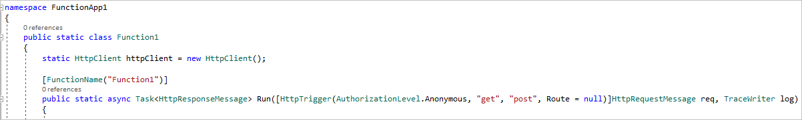

# Azure Function

This sample wraps the [LUIS](https://docs.microsoft.com/azure/cognitive-services/LUIS/) endpoint query in an [Azure Function](https://azure.microsoft.com/services/functions/), which allows serverless endpoint access.

The bot/client app HTTP calls into the [C# HttpTrigger](https://docs.microsoft.com/en-us/azure/azure-functions/functions-create-first-azure-function) function of the Azure function. The function then passes the query to LUIS, gets a response, and inserts the response into a [SQL table](https://azure.microsoft.com/services/sql-database/) you created in the Azure portal. 

### Real-time query logging
LUIS currently provides a [30-day log](https://westus.dev.cognitive.microsoft.com/docs/services/5890b47c39e2bb17b84a55ff/operations/5890b47c39e2bb052c5b9c36)  as a single file download. But to log past the 30 days, this sample captures log information per query and inserts the LUIS response into your SQL table. SQL now provides [JSON path queries](https://docs.microsoft.com/sql/relational-databases/json/json-path-expressions-sql-server), so you can quickly query into your logs. 

Since you have the request at the point of origin, and the results, you can alter the bot/client app to add even more meaningful information to the log including user information such as location, email, etc. These additional features are not demonstrated in this example.

## Prerequisites
* Azure subscription - if you don't have an Azure subscription, create a [free account](https://azure.microsoft.com/free/?WT.mc_id=A261C142F) before you begin. 
* An app to use already created, trained, and published in [luis.ai](https://www.luis.ai/). If you need to create an app, try building one with a prebuilt domain so your intents are already created: [Quickstart: Use prebuilt Home automation app](https://docs.microsoft.com/en-us/azure/cognitive-services/luis/luis-get-started-create-app).
* With your Azure subscription, create a new resource: [Azure SQL Database](https://azure.microsoft.com/services/sql-database/). Take note of your SQL username and password you create, because you'll need it later for your connection string.

## Azure SQL Database
The code in this sample inserts the JSON response from LUIS as text into your SQL database. You may choose to store it in a different type of database or a different type of column in the SQL Server. 

NOTE: This example does not use best practices. You should apply your own security and data cleaning before inserting into the table. 

1. Open your SQL database in Azure to the query editor and add/run this query to create your table: 

```SQL
CREATE TABLE [dbo].[LUIS](
	[Id] [int] IDENTITY(1,1) NOT NULL,
	[Endpoint][nvarchar](300) NOT NULL,
	[Subscription][nvarchar](50) NOT NULL,
	[Application][nvarchar](50) NOT NULL,
	[Query] [nvarchar](max) NOT NULL,
	DateCreated DATETIME NOT NULL DEFAULT(GETDATE()),
 CONSTRAINT [PK_LUIS] PRIMARY KEY CLUSTERED 
(
	[Id] ASC
)WITH (STATISTICS_NORECOMPUTE = OFF, IGNORE_DUP_KEY = OFF) ON [PRIMARY]
) ON [PRIMARY] TEXTIMAGE_ON [PRIMARY]
GO
```
2. You are now ready to create the Azure function app, which will insert data into your SQL database.

## Azure Functions

Azure functions allow you to quickly get an HTTP endpoint without dealing with the configuration or management of an Internet server. 

Instead of making an HTTP call to the LUIS endpoint, you will make an HTTP call to the Azure function. You pass the LUIS utterance either in the HTTP GET query string or in the HTTP POST body to the Azure function.  

The Azure function gets the LUIS utterance, as "query", then passes it along to the LUIS endpoint. The Azure function gets the LUIS response, inserts the response into the SQL table, then returns the LUIS response back to the bot or client app. 

### Create the function app in Azure

This sample was written inside the Azure portal for Azure functions. Copy the code in [run.csx](./run.csx) into a new C# HTTPTrigger function. This quickstart will help you build a function in Azure: [Create your first function in the Azure portal](https://docs.microsoft.com/en-us/azure/azure-functions/functions-create-first-azure-function). Be sure to choose `On` for Application Insights when creating the function app. If you did not do that in creation, you can do it here: [Application Insights integration with Functions](https://blogs.msdn.microsoft.com/appserviceteam/2017/05/10/application-insights-integration-with-functions-now-in-preview/). Having Application Insights "on" will enable more detailed debugging in the Azure portal function app console.

### Or ... create the function app in Visual Studio

1. Follow [Create your first function using Visual Studio](https://docs.microsoft.com/en-us/azure/azure-functions/functions-create-your-first-function-visual-studio).

1. Add the NuGet packages `System.Net.Http`, `System.IO`, `System.Data.SqlClient`, and `Microsoft.AspNetCore.Http`. Copy any missing `using` declarations found at the top of the [run.csx](./run.csx) file in this sample that are not in your function app, and add them to your app. Do not copy the `#r` declarations at the top of the `run.csx` file into your Visual Studio app, as these lines are only used for creating the app in the Azure portal.

1. Copy the code inside the `async Run()` function from the [run.csx](./run.csx) file and insert it into the `async Run()` function in your Visual Studio function app. Include the `static HttpClient httpClient = new HttpClient();` instantiation line from [run.csx](./run.csx) and place it right after the class declaration of your app, like this:

    

#### Enable your SQL database firewall
1. When running from Visual Studio, your SQL database's firewall needs to accept your IP address in order to allow changes to your table.

1. To enable your IP address, go to your SQL database `Overview` page in Azure.

1. See the server name in the upper right and click on it. This changes the menu structure as you are now in the SQL server.

1. In the menu on the left, choose `Firewalls and virtual networks` under `Security`.

1. Under the `Rule Name`, create a name, like Client IP Address, then add your IP address to both `Start IP` and `End IP`. Click anywhere outside of the fields to add it. NOTE: if using a VPN, your IP address will be different than your local IP address. Use the VPN one. If you use the wrong IP address you'll get an unauthorized error.

1. Select `Save`.

## Replace variables, run the code

1. Whether or not you created your app in Azure or Visual Studio you'll need to change the variable values before testing:

    * LUISappID - LUIS app ID. Find by going to `MyApps` in [luis.ai](https://www.luis.ai/), click on the app you wanted to use for this     sample, go to `Manage`, then choose `Application Information` on the left to find `Application ID`.
    * LUISsubscriptionKey - LUIS subscription ID. Also found in your app's `Manage` tab, choose `Keys and Endpoints` on the left, then       use the `Authoring Key`. While you are in `Keys and Endpoints`, double check that your app has been assigned a resource. If so, it     will show a row of resource details and the resource name will be `Starter_Key`. If it has not been assigned, assign it by clicking     `+ Assign resource` and choosing the right settings. Your resource name to choose is the one from your LUIS resource in Azure.
    * SQLconnectionString - SQL connection string. Find on the `Overview` page of your SQL database resource in Azure. Copy the string       from the `Connection strings` on the upper right. Be sure these Azure SQL variables are unique in your string:            `YOUR_DATABASE_NAME`, `YOUR_CATALOG`, `USER`, `PASSWORD`.

1. Build, then run the code.

## Test while running

1. To test in your browser, copy the URL displayed in the console. It will look similar to this: `http://localhost:7071/api/Function1`. 

1. Add a query on the end of the URL, like this: `http://localhost:7071/api/Function1?query=hello`, then press enter.

1. The result in the console and browser will show the query with the intents associated with that query in JSON, according to the intents in your app. The lower the score, the less the query is associated with a specific intent. Changing your query in the test, while running, will yield different scores with the intents.

1. Go to your SQL database resource in Azure, choose the `Query editor` (you may need to sign into your SQL database), select your `dbo.LUIS` table under `Tables`, then click `Edit Data` to view your table. For each query, 1 row has been added to the table. If you don't see it, make sure you published your Azure function app back to Azure, before running the app.
