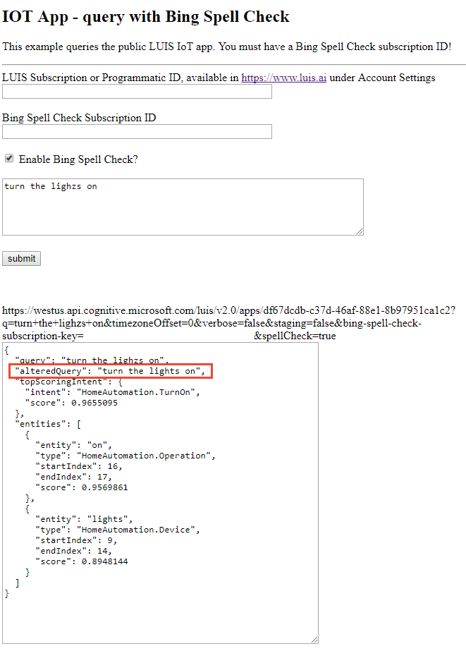

# LUIS Query with spell check

This Javascript example sends a query to the LUIS endpoint with Bing Spell Check turned on. This example corrects any misspelling with your own Bing Spell Check ID before it is submitted to the public IoT LUIS app.

## Prerequisites
* [Bing Spell Check](https://azure.microsoft.com/en-us/services/cognitive-services/spell-check/) subscription. 
* [LUIS](https://azure.microsoft.com/en-us/services/cognitive-services/language-understanding-intelligent-service/) subscription. 

## Misspelled query
The query `turn the lighzs on` is misspelled on purpose. When the query is run, the response will include the `alteredQuery` field -- the text of the query submitted to LUIS.

