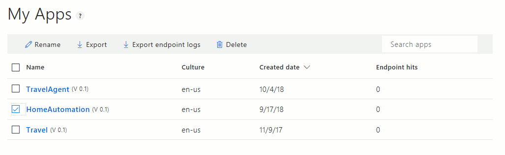

# Upload utterances from Query log
This demonstration app shows how to import queries from an application's query log from [luis.ai](http://www.luis.ai).

To export a LUIS app's query log, select the app in the My Apps screen, then select **Export endpoint logs.** 



Change the `downloadFile` value in the `index.js` file to the location and name of your file. Follow the rest of the [instructions for the demonstration apps](../README.md).

### Format of Query log
The format of the query log is a CSV file with a heading row. The parsing needs to ignore the first two columns and focus on the third column.  

````
"Query","UTC DateTime","Response"
"go to paris",10/04/2017 17:56:05,"{""query"":""go to paris"",""intents"":[{""intent"":""BookFlight"",""score"":0.9999256},{""intent"":""None"",""score"":0.16970253}],""entities"":[{""entity"":""paris"",""type"":""Location::LocationTo"",""startIndex"":6,""endIndex"":10,""score"":0.797421634}]}"
"ticket to paris",10/04/2017 18:15:58,"{""query"":""ticket to paris"",""intents"":[{""intent"":""BookFlight"",""score"":0.9999747},{""intent"":""None"",""score"":0.149017587}],""entities"":[{""entity"":""paris"",""type"":""Location::LocationTo"",""startIndex"":10,""endIndex"":14,""score"":0.9220803}]}"

````
