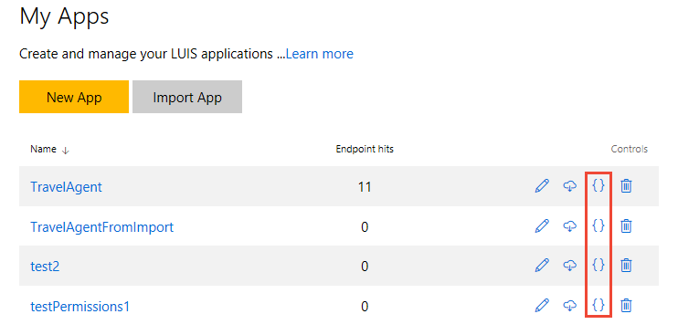

# Upload utterances from exported LUIS app
This demonstration app shows how to import queries from an application that has been exported from [luis.ai](http://www.luis.ai).

To export a LUIS app, switch to the app's Manage page, then choose Versions from the sidebar. Select the version of the app to be exported, then select **Export**.



Change the `exportFile` value in the `index.js` file to the location and name of your file. Follow the rest of the [instructions for the demonstration apps](../README.md).

### Format of Exported app
The format of the exported app is a JSON file containing all the app's data, including the utterances. Only the utterances array needs to be parsed because the property names for the batch upload JSON are different.

````
{
    "utterances": [
          {
            "text": "turn on the lights",
            "intent": "TurnAllOn",
            "entities": []
          },
          {
            "text": "turn the lights off",
            "intent": "TurnAllOff",
            "entities": []
          }
    ]
}
````
